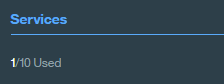

# Food-Coach

This application demonstrates how the Conversation Service can be adapted to use Tone Analyzer's tone along with intents and entities in a simple chat interface.


For more information about the Conversation Service, see the [detailed documentation](http://www.ibm.com/watson/developercloud/doc/conversation/overview.shtml).
For more information about the Tone Analyzer Service, see the [detailed documentation](http://www.ibm.com/watson/developercloud/tone-analyzer.html).

<b> You can deploy this app either on Bluemix or locally. However, either way you deploy this app, you must have a Bluemix account and run some steps within Bluemix.</b>

&nbsp;&nbsp;&nbsp;&nbsp;&nbsp;&nbsp;&nbsp;&nbsp;&nbsp;&nbsp;&nbsp;&nbsp;&nbsp;&nbsp;&nbsp;&nbsp;&nbsp;&nbsp;&nbsp;&nbsp;&nbsp;&nbsp;&nbsp;&nbsp;&nbsp;&nbsp;&nbsp;&nbsp;&nbsp;&nbsp;&nbsp;&nbsp;&nbsp;&nbsp;&nbsp;&nbsp;[](#bluemix)     &nbsp;&nbsp;&nbsp;&nbsp;&nbsp;&nbsp;&nbsp;&nbsp;&nbsp;&nbsp;&nbsp;&nbsp;&nbsp;&nbsp;&nbsp;&nbsp;&nbsp;&nbsp;&nbsp;&nbsp;&nbsp;&nbsp;&nbsp;&nbsp;[](#local)

<a name="what-app-does">
# What does this app do - More Details

The app interface is designed for chatting with a coaching bot.  It asks the user if they've had a particular meal - breakfast, lunch, or dinner - based on time of day, and what s/he ate.

The chat interface is in the left panel of the UI, and the JSON response object that the Conversation Service returns in the right panel. The user's input is run against a small set of sample data trained with the following intents:

    yes: acknowledgment that you ate food
    no: you did not eat a particular meal
    help
    exit

The dialog is also trained on two types of entities - food items and unhealthy food items. These intents and entities help the system understand variations on user input.

After asking the user what s/he ate (if a meal was consumed), the bot asks the user how s/he feel about it. Depending on the user's emotional tone, the bot provides different feedback. Below you can see some sample interactions:


In order to integrate tone with conversation, the approach followed was:
<ul>
<li>Intercept the user message. Before sending it to the Conversation Service, invoke the Tone Analyzer. See function - invokeToneConversation in 
<li>Parse the JSON response object from the Tone Analyzer, and add appropriate variables to the context object of the JSON payload to send to the Conversation Service. See - 
<li>Send the user input, along with the updated context to the Conversation Service. See function - invokeToneConversation in 
</ul>

You can see the raw responses in the right hand panel. 


In the conversation template, alternative bot responses were encoded based on the user's emotional. For example - 


</a>


# FIX THIS SECTION #

<a name="bluemix">
# Getting Started using Bluemix
</a>


## Before you begin
1 Ensure that you have a [Bluemix account](https://console.ng.bluemix.net/registration/).

2 Ensure that you have the necessary space available in your Bluemix account. This action deploys 1 application and 1 service.
   * You can view this on your Bluemix Dashboard. Tiles will show what space you have available.
   * For example, for Services & APIS

    &nbsp;&nbsp;&nbsp;&nbsp;&nbsp;&nbsp;&nbsp;&nbsp;&nbsp;&nbsp;&nbsp;&nbsp;

## Deploy the App
1 Select Deploy to Bluemix.

&nbsp;&nbsp;&nbsp;&nbsp;&nbsp;&nbsp;&nbsp;&nbsp;&nbsp;&nbsp;&nbsp;&nbsp; [](https://bluemix.net/deploy?repository=https://github.com/aprilwebster/conversation-simple-coach)

2 Log in with an existing Bluemix account or sign up.

3 Name your app and select your REGION, ORGINIZATION, and SPACE. Then select DEPLOY.
&nbsp;&nbsp;&nbsp;&nbsp;&nbsp;&nbsp;&nbsp;&nbsp;&nbsp;&nbsp;&nbsp;&nbsp; 

* This performs two actions:
  - Creates the app
  - Creates a Conversation service instance that the user needs for workspace creation
  - Creates a Tone service instance that the user needs for workspace creation

* The status of the deployment is shown. This can take some time.

&nbsp;&nbsp;&nbsp;&nbsp;&nbsp;&nbsp;&nbsp;&nbsp;&nbsp;&nbsp;&nbsp;&nbsp;

4 Once your app has deployed, select VIEW YOUR APP.

&nbsp;&nbsp;&nbsp;&nbsp;&nbsp;&nbsp;&nbsp;&nbsp;&nbsp;&nbsp;&nbsp;&nbsp;

<a name="returnbluemix">
5 Navigate to your Bluemix Dashboard and [import a workspace](#workspace). Setup your workspace then <b>return to these steps</b>.
</a>

6 After you have set up a workspace, [add the WORKSPACE_ID environment variable](#env).

<a name="usingCloudfoundry">
## Using Cloudfoundry CLI tool to deploy your application
</a>

To build the application:

1 Download and install the [Cloudfoundry CLI](https://github.com/cloudfoundry/cli) tool.

2 Git clone the project `https://github.com/watson-developer-cloud/conversation-simple`

3 Navigate to the `conversation-simple` folder

4 Connect to Bluemix in the command-line tool:

 For US Region

 ```sh

 $ cf api https://api.ng.bluemix.net

 ```

 ```sh

 $ cf login -u <your user ID>

 ```

5 Create the Conversation service in Bluemix:

 ```sh

 $ cf create-service conversation free conversation-service

 ```
6 Create the Tone Analyzer service in Bluemix:

 ```sh

 $ cf create-service tone_analyzer standard tone-analyzer-standard

 ```

7 Push it live:

 ```sh

 $ cf push <application-name>

 ```
 The name you use determines your application URL initially, such as `<application-name>.mybluemix.net`.

<a name="local">
# Getting Started locally
</a>

## Before you begin

1 Ensure that you have a [Bluemix account](https://console.ng.bluemix.net/registration/). While you can do part of this deployment locally, you must still use Bluemix.

<a name="returnlocal">
2 In Bluemix, [create a Conversation Service](http://www.ibm.com/watson/developercloud/doc/conversation/convo_getstart.shtml).
- [Import a workspace](#workspace)
- Copy the [Service Credentials](#credentials) for later use.
- <b>Return to these steps</b>
</a>

## Running locally

  The application uses [Node.js](http://nodejs.org/) and [npm](https://www.npmjs.com/).

1 Copy the credentials from your `conversation-service` and "tone-analyzer" service in Bluemix to a `.env` file in the root.

2 Use the Conversation tooling app to [import a workspace](#workspace) and add the workspace ID environment variable to the `.env` file. For details about obtaining the workspace ID, see Step 5 in the workspace section.

3 Install [Node.js](http://nodejs.org/).

4 Open the terminal, go to the project folder, and run this command:
    ```
    npm install
    ```

5  Start the application by running this command:
    ```
    npm start
    ```

6 Open `http://localhost:3000` in a browser.

_Note: If you are interested in deploying you local application or the changes you have made locally to Bluemix, go to [this section](#usingCloudfoundry)_

<a name="credentials">
# Service Credentials
</a>

1 Go to the Bluemix Dashboard and select the Conversation service instance. Once there, select the **Service Credentials** menu item.

&nbsp;&nbsp;&nbsp;&nbsp;&nbsp;&nbsp;&nbsp;&nbsp;&nbsp;&nbsp;&nbsp;&nbsp;

2 Select **ADD CREDENTIALS**. Name your credentials then select **ADD**.

3 Copy the credentials (or remember this location) for later use.

4 Repeat this step for tone analyzer service instance.


<a name="workspace">
# Import a workspace
</a>

To use the app you're creating, you need to add a worksapce to your Conversation service. A workspace is a container for all the artifacts that define the behavior of your service (ie: intents, entities and chat flows). For this sample app, a workspace is provided.

For more information on workspaces, see the full  [Conversation service  documentation](https://www.ibm.com/smarterplanet/us/en/ibmwatson/developercloud/doc/conversation/overview.shtml).

1 Navigate to the Bluemix dashboard, select the Conversation service that you created.

2 Go to the **Manage** menu item and select **Launch Tool**. This opens a new tab in your browser, where you are prompted to login if you have not done so before. Use your Bluemix credentials.

3 Use the workspace file available in training folder (training/food_coach_workspace.json)

4 Select the import icon: . Browse to (or drag and drop) the JSON file. Choose to import **Everything(Intents, Entities, and Dialog)**. Then select **Import** to finish importing the workspace.

5 Refresh your browser. A new workspace tile is created within the tooling. Select the _menu_ button within the workspace tile, then select **View details**:

&nbsp;&nbsp;&nbsp;&nbsp;&nbsp;&nbsp;&nbsp;&nbsp;&nbsp;&nbsp;&nbsp;&nbsp;

<a name="workspaceID">
In the Details UI, copy the 36 character UNID **ID** field. This is the **Workspace ID**.
</a>

&nbsp;&nbsp;&nbsp;&nbsp;&nbsp;&nbsp;&nbsp;&nbsp;&nbsp;&nbsp;&nbsp;&nbsp; 

6 Return to the deploy steps that you were following:
- For Local - [return to step 2](#returnlocal)
- For Bluemix - [return to step 5](#returnbluemix)

<a name="env">
# Adding environment variables in Bluemix
</a>

1 In Bluemix, open the application from the Dashboard. Select **Environment Variables**.

2 Select **USER-DEFINED**.

3 Select **ADD**.

4 Add a variable with the name **WORKSPACE_ID**. For the value, paste in the Workspace ID you [copied earlier](#workspaceID). Select **SAVE**.

&nbsp;&nbsp;&nbsp;&nbsp;&nbsp;&nbsp;&nbsp;&nbsp;&nbsp;&nbsp;&nbsp;&nbsp;

5 Restart your application.


# Troubleshooting in Bluemix

#### In the Classic Experience:
- Log in to Bluemix, you'll be taken to the dashboard.
- Navigate to the the application you previously created.
- Select **Logs**.

&nbsp;&nbsp;&nbsp;&nbsp;&nbsp;&nbsp;&nbsp;&nbsp;&nbsp;&nbsp;&nbsp;&nbsp;

- If you want, filter the LOG TYPE by "APP".

&nbsp;&nbsp;&nbsp;&nbsp;&nbsp;&nbsp;&nbsp;&nbsp;&nbsp;&nbsp;&nbsp;&nbsp;

#### In the new Bluemix:
- Log in to Bluemix, you'll be taken to the dashboard.
- Select **Compute**

&nbsp;&nbsp;&nbsp;&nbsp;&nbsp;&nbsp;&nbsp;&nbsp;&nbsp;&nbsp;&nbsp;&nbsp;

- Select the application you previously created.
- Select **Logs**.

&nbsp;&nbsp;&nbsp;&nbsp;&nbsp;&nbsp;&nbsp;&nbsp;&nbsp;&nbsp;&nbsp;&nbsp;

- If you want, filter the Log Type by selecting the drop-down and selecting **Application(APP)**.

&nbsp;&nbsp;&nbsp;&nbsp;&nbsp;&nbsp;&nbsp;&nbsp;&nbsp;&nbsp;&nbsp;&nbsp;

# Troubleshooting with CLI

To see the logs, run the command

`$ cf logs < application-name > --recent`

# License

  This sample code is licensed under Apache 2.0.
  Full license text is available in [LICENSE](LICENSE).

# Contributing

  See [CONTRIBUTING](CONTRIBUTING.md).


## Open Source @ IBM

  Find more open source projects on the
  [IBM Github Page](http://ibm.github.io/).
